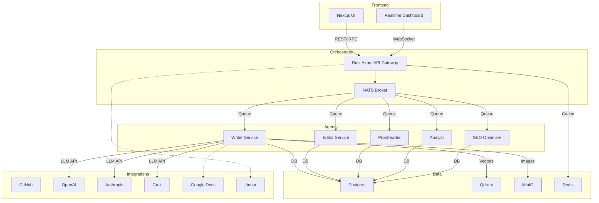

# Crypto Content Platform – Rebuild Architecture

## 1. Vision & Goals
Build a highly-scalable, fault-tolerant platform that automates crypto-focused content production while giving editors full control and transparency. The new stack prioritises performance, developer ergonomics, top-tier UX/UI, and modular AI-first design.

## 2. Core Capabilities
1. Project-scoped knowledge base (references, images, stats)
2. Pluggable AI agent pipeline (Writer → Editor → Proofreader → Analyst → SEO)
3. Real-time collaboration & monitoring (live logs, progress bars, agent chat)
4. Flexible content templates & bulk generation
5. Full audit trail & versioning for articles and training runs
6. Permissions & roles (Admin, Editor, Writer, Viewer, API)
7. Integrations:
   • GitHub Copilot Pro, Grok, Anthropic, OpenAI, Google AI
   • Google Docs/Drive (import rich articles)
   • Linear (issue tracking & roadmap sync)
   • Qdrant / Qdrant Cloud for vector search (references)

## 3. Target Tech Stack
• **Frontend** – Next.js 15 (App Router), TypeScript, Tailwind, shadcn/ui
• **Backend** – Rust (Axum) for core APIs & orchestrator, Node.js (NestJS) micro-services for AI agents where required
• **Data** – Postgres, Redis, Qdrant (vectors), MinIO (images)
• **Async & Realtime** – NATS JetStream, WebSockets (Y-Push) via tRPC subscription layer
• **Infra** – Kubernetes (GKE/EKS), Helm charts, GitHub Actions CI/CD
• **Observability** – OpenTelemetry, Tempo, Prometheus, Grafana.

## 4. High-Level Component Map

## 45. Team Responsibilities Snapshot
- **Backend Team**: build Axum Orchestrator with Auth & RBAC
- **AI Team**: scaffold Writer, Editor, Proofreader, Analyst, SEO NestJS services
- **AI Team**: implement modelRouter & retry/circuit middleware
- **Frontend Team**: build Next.js app shell with layout, auth, and project switcher
- **Frontend Team**: implement real-time Dashboard & Agent monitor
- **Data Team**: build Google Docs/Drive importer & vector pipeline to Qdrant
- **Growth Team**: develop UTM redirect worker + ClickHouse sink
- **Observability stack**: Prometheus, Grafana, Loki, Tempo
- **DevOps**: write Helm charts for all services

---

*This architecture document serves as the comprehensive blueprint for the crypto content platform rebuild.*